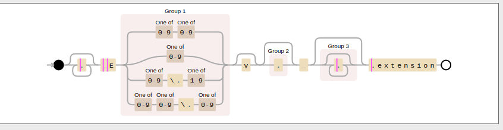

[](https://github.com/BastianGanze/weebsync/actions/workflows/main.yml)

# Getting started
To run this, download one of the executables for your operating system from the current release or build it as a docker container. (Look down for further information)

Once the executable is running, you can access the ui by opening a browser and going to http://0.0.0.0:42380.
(Or another port if you changed it.)

# Application configuration
The application will attempt to create a "config" folder in its executables' directory.
To overwrite where the configuration is being stored you can use the env variable `WEEB_SYNC_CONFIG_DIR` but it must be an absolute path!

Further application behaviour can be configured through environment variables:
#### WEEB_SYNC_CONFIG_DIR
The application will attempt to create the directory and config file upon startup.
Set this do an absolute value e.g. `/home/user/weebsyncconfig` or `c:/users/user/AppData/local/weebsync`.
If you don't set this, a config dir will be created automatically at the executables' directory.

#### WEEB_SYNC_PLUGIN_DIR
The application will attempt to load plugins from this directory.
Set this do an absolute value e.g. `/home/user/weebsyncconfig` or `c:/users/user/AppData/local/weebsync`.
If you don't set this, a plugin folder may be created next to the executable.

#### WEEB_SYNC_SERVER_HTTP_PORT
default value is `42380`
Determines on what port the application will run.

#### WEEB_SYNC_SERVER_HOST
default value is `0.0.0.0`
Determines on what host the application will bind to.

# Rename regex feature
In the sync maps you can setup a filename regex and a rename template.
The filename regex will be matched to every file in the origin folder and changes download behaviour: Only files matching will be downloaded:

### Regex
example:
```regexp
.*? E([0-9][0-9]|[0-9]|[0-9]\\.[1-9]|[0-9][0-9]\\.[0-9])v?(.)? (.*)?\.extension
```

This will match `Test E1 [metadata].extension` but also `Test E1v3 [metadata].extension`.

To build regex visually try https://www.debuggex.com/.

### Rename template

For the rename template you have some variables at your disposal, here is an example with the regex from before in mind:

```text
{{$syncName}} - {{renumber $1 13}} {{$3}}.extension 
```

If Sync name in your config is `Something Something test` and the file to match is `Test E1 [metadata].extension` you will get:

```
Something Something test - 1 [metadata].extension
```

#### $syncName
The Sync name field of your sync map entry, just a handy shortcut so you can re-use your rename template.

#### $1 $2 $3...
To understand this lets look at this picture:



This is the regex from the earlier example visualized. As you can see there are groups (Group 1, Group 2, Group 3).
These groups are made available through $1 $2 and $3 respectively, you create a new group each time you put something in paranthesis.

#### renumber
A function to add or subtract from a number you captured in your regex group. The regex group capture must be a number only, no other characters!

# Run as Docker container
Make sure the volume points to a correct, absolute and existing path on your filesystem.
```
docker build -t weebsync .
docker run -d --name weebsync -p 42380:42380 -v /home/user/wsconfig/:/config weebsync
```

# Develop
```
docker build -t weebsync-dev -f Dockerfile-dev .
docker run -d --name weebsync-dev -p 42380:42380 -v /path/to/repository/:/app weebsync-dev
```
